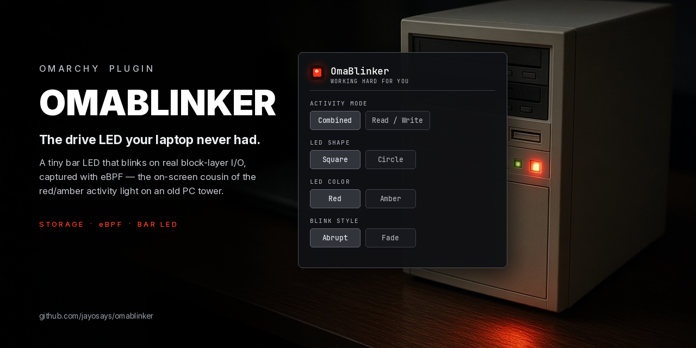

# OmaBlinker



A third-party [Omarchy](https://omarchy.org) Quattro shell plugin that adds
a small LED to the bar and blinks it whenever the kernel reports storage
activity — the on-screen equivalent of the red/amber drive-activity LED on
old PC towers, minus the actual LED (most laptops don't have one). If your
machine *does* have a spare, software-controllable LED under
`/sys/class/leds/`, OmaBlinker can drive that too, in lockstep with the
on-screen one.

Click the LED to open a settings popup: a Mode setting picks a single
combined LED (default), independent green-for-read / red-for-write LEDs,
or those two plus a third blue LED that splits cache-hit reads out on
their own (see
[The cache-hit read LED](#the-cache-hit-read-led)) — plus shape
(square/circle), color (for the combined LED), and blink style (an instant
snap or a brief fade).

## How it works

Storage activity is detected with **eBPF**, not by polling
`/proc/diskstats`. A small BPF program, written in Rust with
[Aya](https://aya-rs.dev), attaches tracepoint probes to
`block:block_rq_issue` and `block:block_rq_complete` — the same two
block-layer tracepoints the standard `biolatency` BCC tool uses — so it
sees every request the kernel issues to any block device and every
completion, independent of filesystem or which disk it lands on. Each
tracepoint hit just increments a per-CPU counter in a BPF map; there's no
per-request syscall or write in the kernel-side hot path.

For the Read/Write display mode, each event is also classified by reading
the tracepoint's `rwbs` field — the same field `biosnoop`/`biotop` read
from these exact tracepoints for their R/W column — bumping one of two
counters instead of one. Reading a tracepoint field means reading raw bytes
at a fixed offset into its argument buffer, which isn't exposed through BTF
the way kprobe arguments are, so the eBPF program mirrors the relevant
prefix of the kernel's own `TP_STRUCT__entry` layout (from the current
[`block.h`](https://github.com/torvalds/linux/blob/master/include/trace/events/block.h))
in a `#[repr(C)]` struct and lets `core::mem::offset_of!` compute the real
offset, rather than hand-deriving or hardcoding a number. See the comment
above `BlockRqEntryPrefix` in `omablinker-bpfd-ebpf/src/main.rs` for the
full derivation and, if it's ever wrong on a given kernel, how to fix it.
(Verified against a real `/sys/kernel/tracing/events/block/block_rq_issue/format`
— the computed offset matched exactly.)

Only a **cache miss** reaches these tracepoints for a read — the kernel
serves a cached read entirely from RAM without ever touching the block
layer, so opening the same file twice only lights the read LED the first
time. Writes don't get the same reprieve: dirty pages, filesystem
journaling, and `fsync` all eventually have to reach the block layer
regardless of caching. In practice this means the write LED tends to fire
far more often than the read one during ordinary use — that's real,
expected behavior, not a bug, and it's easy to confirm directly by forcing
an uncached read and watching the LEDs respond:

```
sudo dd if=/dev/<your-drive> of=/dev/null bs=1M count=500 iflag=direct
```

(`lsblk` to find `<your-drive>`, e.g. `nvme0n1` or `sda`. `iflag=direct`
bypasses the page cache entirely, guaranteeing real block-layer reads. This
only *reads* the drive and discards the result to `/dev/null` — nothing on
it is touched or modified.) The read LED should light up for the duration
of the command; opening a file you haven't touched recently (so it's cold
from cache) does the same thing more organically.

### The cache-hit read LED

Picking `Cache Hit/Read/Write` as the Mode (see
[Appearance](#appearance)) adds a third, blue LED that splits cache *hits*
out from the green Read LED onto their own indicator, rather than leaving
them folded silently into "any read" the way `Combined` and `Read/Write`
both do. The row reorders left to right as blue (cache hit), green (direct
read only, once split out), red (write), and adds a "C" label alongside
the existing "R"/"W" ones if **Show I/O Labels** is on. It's fed by a
kprobe on `folio_mark_accessed`, the function on the
buffered-read hot path (`filemap_read`/`generic_file_buffered_read`) that
marks a page-cache folio as recently used — the folio-based counterpart to
the older page-based `mark_page_accessed` BCC's `cachestat` hooks for the
same purpose; on a folio-converted kernel (6.1+), that older function is only a
thin compatibility wrapper that the read path itself never actually calls,
so hooking it would attach cleanly but silently never fire. This is a
different, less stable kind of hook than the two tracepoints above (an
ordinary kernel function rather than the tracepoint ABI), so the daemon
attaches it best-effort: if it fails on a given kernel, cache-read tracking
is silently disabled and the rest of OmaBlinker works exactly as before.

It also fires *far* more often than real block I/O — a cache hit is the
entire point of not reaching the block layer — so it isn't wired up like
the other LEDs, which mirror real event timing. Mirrored 1:1, this LED
would just read as solid-on, not blinking, on any non-idle machine.
Instead it checks in every 400ms and, if there was any cache-read activity
at all since the last check, blinks once for 120ms — a heartbeat that says
"the cache is busy," not a precise per-request signal. This is deliberate:
OmaBlinker is a vibes-based activity light, not a profiling tool, and a
literal rendering of real cache-hit *volume* would be useless as a blinking
indicator anyway (see `PulseChannel` in `omablinker-bpfd/src/main.rs`).

Loading a BPF program needs root, which the desktop shell process doesn't
have and shouldn't be given, so the plugin is split into a privileged
daemon and an unprivileged widget that only talk through a plain,
world-readable state file — no sockets, no D-Bus, no capabilities handed
to the shell process, and no subprocess on either side of that handoff:
the daemon overwrites the file in place, and the widget watches it
natively with Quickshell's `FileView`:

```
 root, via systemd               your desktop session, via Omarchy
┌────────────────────────┐       ┌──────────────────────────────────┐
│ omablinker-bpfd (Rust) │       │ Service.qml   (kind: service)    │
│  - loads the eBPF      │       │  - watches state via             │
│    program (Aya)       │       │    FileView, no subprocess       │
│  - polls a per-CPU     │──────▶│                                  │
│    counter map ~50/s   │ world-│ BarWidget.qml (kind: bar-widget) │
│  - overwrites          │ file  │  - draws the LED, reflects       │
│    /run/omablinker/    │       │    Service's active state        │
│    state in place      │       │                                  │
│  - optionally blinks   │       └──────────────────────────────────┘
│    a real sysfs LED    │
└────────────────────────┘
```

Neither side ever shells out to run an external command: the widget reads
and writes its own settings the same way, via `FileView`, rather than
`bash -c` snippets — no bare executable names resolved through an
inherited `PATH`, nothing that could be hijacked by a malicious binary
earlier on that `PATH`.

`omablinker-bpfd` is a single ~1.7 MB, single-threaded, dynamically-linked
binary (only glibc/libgcc — no Python, no embedded clang/LLVM, no async
runtime) that attaches its tracepoints and is sitting idle within
milliseconds of starting. It polls its BPF map roughly 50 times a second
rather than waking up per I/O request, so a drive doing tens of thousands
of IOPS costs the same few cheap map-lookups per second as an idle one.
Being single-threaded doesn't reduce what it sees: the per-CPU map already
aggregates every core's counter inside the kernel, and one thread reads all
of them in a single syscall.

As required of any third-party Omarchy plugin, everything here is plain,
readable code: `manifest.json` + `Service.qml` + `BarWidget.qml` are the
whole shell-side plugin, and `bpfd/` is the whole privileged daemon. Nothing
is obfuscated or fetched at install time.

## Install

The normal Omarchy way, once this is listed on the plugin registry (or
right away, by pointing at this repo directly):

```
omarchy plugin add https://github.com/jayosays/omablinker.git --enable
```

That installs and enables the bar widget itself. It doesn't set up the
privileged eBPF daemon, though — per Omarchy's plugin model, `plugin add`
never runs anything from a plugin or asks for sudo, so that's a separate,
explicit step:

```
cd ~/.config/omarchy/plugins/jayosays.omablinker
./install.sh
```

`install.sh`:
1. Installs `rustup` and `bpf-linker` if either is missing.
2. Builds `omablinker-bpfd` in release mode.
3. Installs the binary and a systemd **system** service for it to run as
   root — it prints exactly what it's about to do first, so read it before
   running, the same way you'd read any third-party plugin before enabling it.
4. Enables the plugin (if it isn't already) and restarts the Omarchy shell
   to activate it — the same enable-then-restart sequence `plugin add
   --enable` does for you, for when this step happens on its own.

Working from a local clone instead (for development, or before pushing
anywhere)? Run the same script from wherever you cloned it — it also
symlinks the checkout into `~/.config/omarchy/plugins/jayosays.omablinker`
itself in that case:

```
git clone <this repo> ~/code/omablinker
cd ~/code/omablinker
./install.sh
```

After enabling it, add the widget to a bar section from *Setup > Plugins*
(or edit `~/.config/omarchy/shell.json` directly — see `defaultSection` in
`manifest.json`, currently `right`).

## Uninstall

```
./uninstall.sh
omarchy plugin remove jayosays.omablinker
```

`uninstall.sh` stops and removes the systemd service and the daemon binary,
and unlinks the plugin from `~/.config/omarchy/plugins/`.
`/etc/omablinker.env` is left in place in case you reinstall later; delete
it yourself if you want it gone too.

## Appearance

Click the LED to open its settings popup:

- **Mode** — `Combined` (default) is a single LED for all block I/O,
  direct reads, cache-hit reads, and writes alike, exactly like the
  daemon's original design. `Read/Write` shows two LEDs instead — green on
  the left, red on the right — since the daemon already classifies every
  event by direction (see [How it works](#how-it-works)); green still
  covers *any* read here, cache hit or not, so this mode never shows blue.
  `Cache Hit/Read/Write` adds that third, blue LED, splitting cache hits
  back out of green so it narrows to direct (block-layer) reads only (see
  [The cache-hit read LED](#the-cache-hit-read-led)) — stays off and inert
  if the daemon's cache-read kprobe didn't attach on this kernel. Green +
  red was also the other ubiquitous vintage-PC LED pairing (power +
  activity), though it wasn't historically used to distinguish read from
  write, and blue never existed on a real drive light at all.
- **LED shape** — `Square` (default) is the boxy drive-activity LED common
  on PC front panels. `Circle` is a classic round 5 mm LED. Applies to
  every LED regardless of Mode.
- **LED color** — `Red` (default) is a saturated red-orange close to the
  5 mm red LEDs used on most beige-box drive lights. `Amber` is the
  orange-yellow tone common on 386/486-era cases (often shared with the
  turbo-mode light on the same front panel). Only shown in `Combined` mode
  — the other two modes' colors are fixed, not a style choice.
- **Show I/O Labels** — shown in either multi-LED mode (`Read/Write` or
  `Cache Hit/Read/Write`), hidden in `Combined`: prints a small
  "R"/"W"/"C" on each LED, appearing and disappearing in sync with it —
  lit only while that LED is, not a permanent label — for telling them
  apart without relying on color at all while activity is happening.
  Red/green is the single most common form of color blindness, so this
  exists specifically for that case, off by default to keep the plain
  look.
- **Blink style** — `Instant` (default) snaps the LED on and off
  instantly, matching how a real drive-activity LED flashes. `Fade` eases
  it in quickly and lets it linger a little on the way out, for a softer
  look.

These are stored in `~/.config/omablinker/widget-prefs.json`, managed
entirely by the popup — there's no separate `manifest.json` settings
schema for appearance at all, since as of this writing nothing in
Omarchy's shell renders a settings form from that schema yet, so a
schema-only setting would have no UI to change it from.

The read/write/combined LEDs don't have their own independent hold-time
setting, deliberately: they mirror the daemon's state directly (see
[How it works](#how-it-works)), so there's exactly one place that decides
how long a burst of activity stays visible — the daemon's own
`OMABLINKER_IDLE_MS`, below. The cache-hit LED is the one exception: its
pulse cadence is fixed in the daemon's `PulseChannel`, not configurable via
`OMABLINKER_IDLE_MS` or anything else, since it isn't tracking a hold time
at all (see [The cache-hit read LED](#the-cache-hit-read-led)).

## Configuring the daemon

Optional settings for `omablinker-bpfd` live in `/etc/omablinker.env` (see
`systemd/omablinker.env.example`), and take effect after
`sudo systemctl restart omablinker`:

| Key                     | Default | Meaning                                                    |
|-------------------------|---------|-------------------------------------------------------------|
| `OMABLINKER_LED_DEVICE` | (unset) | sysfs brightness path of a real LED to blink as well        |
| `OMABLINKER_IDLE_MS`    | `120`   | How long a burst of activity stays "active" after the last event, for both the on-screen and any physical LED |

Find real LED candidates with `ls /sys/class/leds/`.

## Troubleshooting

```
systemctl status omablinker       # is the daemon running?
journalctl -u omablinker -f       # attach errors, LED device errors, etc.
cat /run/omablinker/state             # combined state: 0 (idle) or 1 (active)
cat /run/omablinker/state-read        # read-only state
cat /run/omablinker/state-write       # write-only state
cat /run/omablinker/state-cache-read  # cache-read pulse; only exists if the kprobe attached
```

If the widget's tooltip says the service isn't running, that's
`Service.qml` reporting that the state file doesn't exist yet — check the
daemon first.

## Development

```
cd bpfd
cargo build --release   # builds omablinker-bpfd-ebpf first, then embeds it in omablinker-bpfd
cargo run -- --led-device /sys/class/leds/foo/brightness   # runs via `sudo -E`, see .cargo/config.toml
```

`omablinker-bpfd-ebpf/src/main.rs` is the whole BPF program — two
`#[tracepoint]` functions, a `#[kprobe]` for the optional cache-read signal,
a per-event read/write classifier, and a 3-entry `PerCpuArray` map.
`omablinker-bpfd/src/main.rs` is the whole daemon: load, attach (the kprobe
best-effort), poll, run three independent event-timed activity/idle state
machines (`Channel`) — combined, read, write — plus an optional fourth,
fixed-cadence one (`PulseChannel`) for cache reads, overwrite their state
files, optionally drive a real LED (combined only), clean up on `SIGTERM`.

Before publishing changes, Omarchy's own plugin guidance applies here too:

```
omarchy plugin validate .
```

### Building the eBPF program

`bpf-linker` links against a specific LLVM major version, and LLVM's
bitcode format isn't stable across majors — if the pinned nightly's bundled
LLVM and your installed `bpf-linker`'s LLVM disagree, the build fails with
`ERROR llvm: Invalid record`. The pinned nightly (`nightly-2026-07-01`,
LLVM 22.1.8) was chosen to match Arch's `bpf-linker` package as of 2026-09;
see the comment at the top of `bpfd/rust-toolchain.toml` for how to re-pin
it if a `pacman -Syu` ever moves that package to a new LLVM major version.

## Why not just use the kernel's built-in `disk-activity` LED trigger?

`/sys/class/leds/<led>/trigger` already supports a `disk-activity` value on
kernels with an LED class device, and it's a fine choice if you only want to
blink real hardware. OmaBlinker exists for the general case — a bar
indicator, since most laptops have no user-controllable drive LED at all —
and because eBPF tracepoints give a single, filesystem-agnostic signal
that's easy to also mirror onto real hardware when one exists, rather than
depending on whichever driver happens to expose the trigger.

© 2026 Jay O ([@jayosays](https://x.com/jayosays)). Built with Claude.